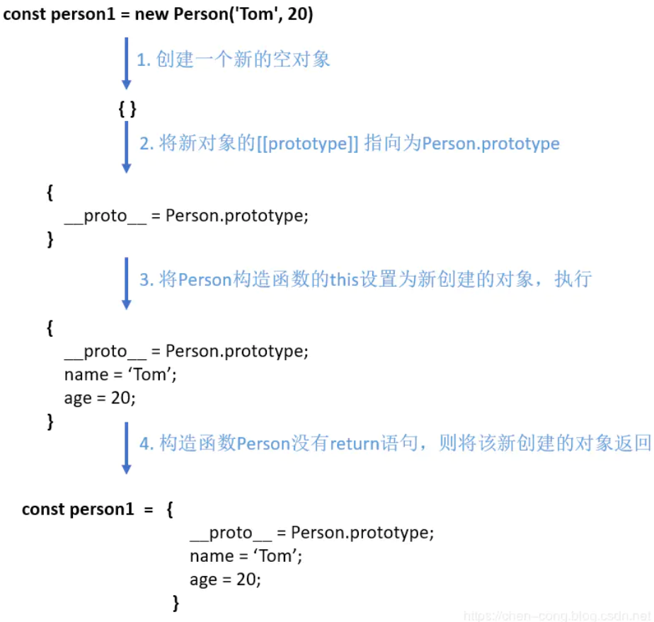

# new

**new** 操作符用于创建一个给定构造函数的实例对象。

## 流程

1. 创建一个新对象
2. 将构造函数的作用域赋给新对象（因此 this 就指向了这个新对象）
3. 执行构造函数中的代码（为这个新对象添加属性）
4. 返回新对象



## 实现

```javascript
function new(Func, ...args) {
    // 1.创建一个新对象
    const obj = {}
    // 2.新对象原型指向构造函数原型对象
    obj.__proto__ = Func.prototype
    // 3.将构建函数的this指向新对象
    let result = Func.apply(obj, args)
    // 4.根据返回值判断
    return result instanceof Object ? result : obj
}
```
