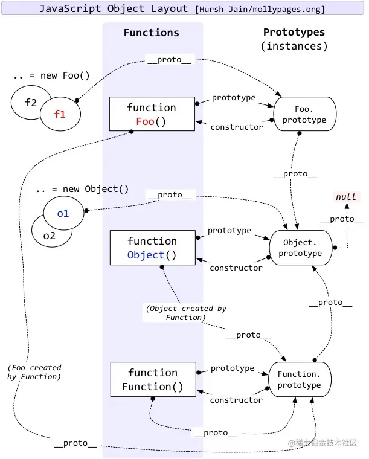

# 原型

每个对象拥有一个原型对象，对象以其原型为模板，从原型继承方法和属性。

## 原型链

原型对象也可能拥有原型，继承方法和属性，一层一层、以此类推，称为原型链。

在对象实例和它的构造器之间建立一个链接（它是__proto__属性，是从构造函数的prototype属性派生的），之后通过上溯原型链，在构造器中找到这些属性和方法

## 总结

原型就是某个实例的构造函数的prototype属性；原型链就是原型的原型，prototype对象也是某个构造函数的实例，所以它也有原型，也就是实例的构造函数的prototype属性的构造函数的prototye属性


```js
person1.__proto__ === Person.prototype

Person.__proto__ === Function.prototype

Person.prototype.__proto__ === Object.prototype

Object.__proto__ === Function.prototype

Object.prototype.__proto__ === null
```

- 一切对象都是继承自Object对象，Object 对象直接继承根源对象null
- 一切的函数对象（包括 Object 对象），都是继承自 Function 对象
- Object 对象直接继承自 Function 对象
- Function对象的__proto__会指向自己的原型对象，最终还是继承自Object对象

